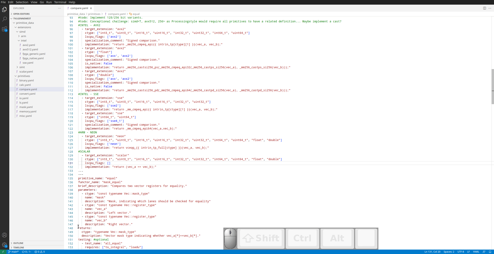
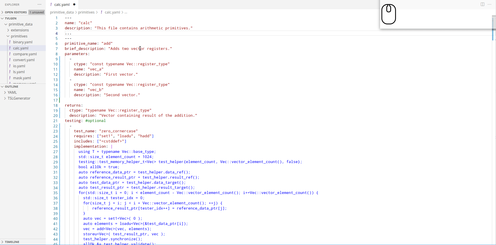
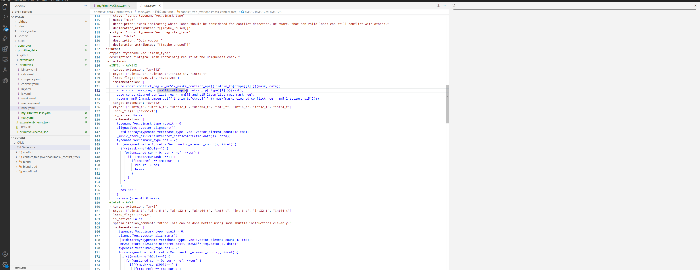

# VS-Code Editor Extension for TSL-Generator Data Files.

The [TSL-Generator](https://github.com/db-tu-dresden/TVLGen) uses YAML files as the data model. 
As YAML sometimes is hard to debug and maintain, the Editor Extension is meant to be used as a tool that makes life easier.

## Features

Currently, the extension supports the following features:
- Outlining (Adding relevant links of a document to the outline)
- Auto-Completion (providing suggestions of possible keys)
- skeleton-creation (creating object sceletons for complex objects)
- Preview (rendering the currently selected primitive using [ctrl]+[alt]+[p])

### Outlining

### Auto-Completion

### Preview

## Known Issues

- Currently, only primitive definitions can be rendered.
- The extension expects a folder structure like [in the consolidate branch](https://github.com/db-tu-dresden/TVLGen/tree/consolidate). Since this branch will be merged very soon, this should not be a big deal.

### 0.0.1

Initial release.

### 0.0.2

Improved Preview.

### 0.0.3

Refactored Library name from TVL to TSL.

### 0.0.4

- Added Focus-Mode.
- Added command to create new data files.
- Optimized Preview rendering.

### Acknowledgments

Thanks to Alexander Krause for getting the web view and rendering up and running. 

Find more interesting research on our [homepage](https://wwwdb.inf.tu-dresden.de/).