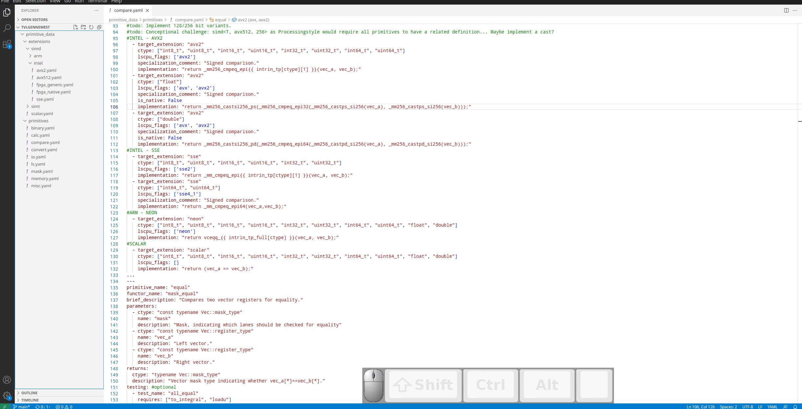

# VS-Code Editor Extension for TSL-Generator Data Files.

The [TSL-Generator](https://github.com/db-tu-dresden/TVLGen) uses YAML files as the data model. 
As YAML sometimes is hard to debug and maintain, the Editor Extension is meant to be used as a tool that makes life easier.

## Features

Currently, the extension supports the following features:

### __New File Creation Wizard__

Adding new data files to the TSL Generator folder.

### __Focus-Mode__

Hide all TSL Generator directories and files which are not relevant for you.

### __Outlining__

Add relevant links of a document to the outline

### __Auto-Completion__

Get suggestions for possible keys. Create object sceletons for complex objects

### __Ad-Hoc Preview__

Render the currently selected primitive.

## Known Issues

- /

### 0.0.1

Initial release.

### 0.0.2

Improved Preview.

### 0.0.3

Refactored Library name from TVL to TSL.

### 0.0.4

- Added Focus-Mode.
- Added command to create new data files.
- Optimized Preview rendering.

### 0.0.5

- Added Sorting of Primitives in a TSL Primitive Data File.
- Added Formating a TSL Data File.

### 0.1.0

- Preview rendering works for primitive-declaration, primitive-definition(s) and extension

### Acknowledgments

Thanks to Alexander Krause for getting the web view and rendering up and running. 

Find more interesting research on our [homepage](https://wwwdb.inf.tu-dresden.de/).